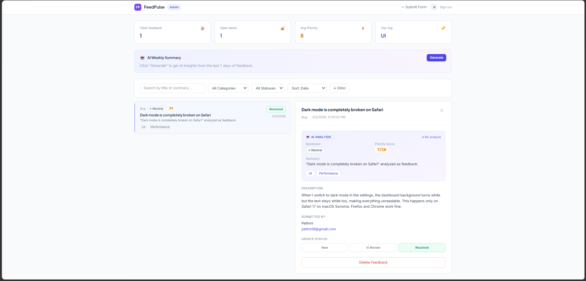
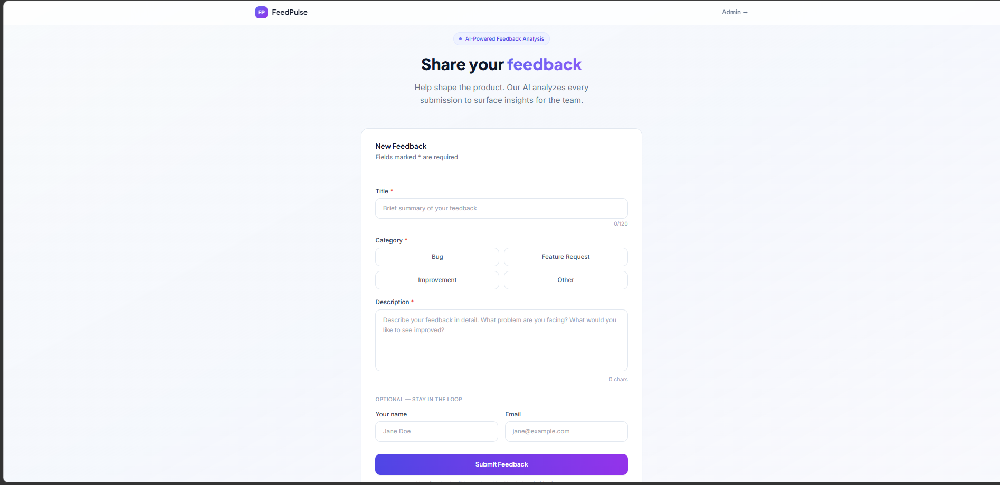

# FeedPulse — AI-Powered Product Feedback Platform

FeedPulse is a full-stack internal tool that lets teams collect product feedback and feature requests, then uses **Google Gemini AI** to automatically categorise, prioritise, and summarise them — giving product teams instant clarity on what to build next.




---

## Tech Stack

| Layer | Technology |
|-------|-----------|
| Frontend | Next.js 14+ (App Router), TypeScript, Tailwind CSS |
| Backend | Node.js + Express, TypeScript |
| Database | MongoDB + Mongoose |
| AI | Google Gemini 2.0 Flash |
| Auth | JWT |
| Testing | Jest + Supertest |
| DevOps | Docker + Docker Compose |

---

## Features

### Public Feedback Form
- Clean form with client-side validation (min 20 chars, required title)
- Category selection — Bug / Feature Request / Improvement / Other
- Character counter on description field
- Rate limiting — max 5 submissions per hour per IP
- Success and error states shown after submission

### AI Analysis (Gemini 2.0 Flash)
- Automatically triggered on every new submission
- Returns category, sentiment, priority score (1–10), summary, and tags
- Feedback is always saved even if Gemini fails — non-blocking
- Admin can manually re-trigger AI analysis on any item
- On-demand AI weekly summary of top themes

### Admin Dashboard
- JWT-protected login
- Stats bar — total feedback, open items, average priority, top tag
- Filter by category and status
- Sort by date, priority score, or sentiment
- Keyword search across title and AI summary
- Inline detail panel with full AI analysis breakdown
- One-click status updates — New → In Review → Resolved
- Pagination (10 items per page)
- Delete feedback items

---

## Getting Started (Local)

### Prerequisites
- Node.js 18+
- MongoDB running locally on port 27017
- A free Google Gemini API key from [aistudio.google.com](https://aistudio.google.com)

### 1. Clone the repo
```bash
git clone https://github.com/pethmivithana/feedpulse.git
cd feedpulse
```

### 2. Set up the backend
```bash
cd backend
# Create your .env file
cp .env.example .env   # or create it manually — see Environment Variables below
npm install
npm run dev
```

### 3. Set up the frontend (new terminal)
```bash
cd frontend
npm install
npm run dev
```

### 4. Open the app
| Page | URL |
|------|-----|
| Feedback form | http://localhost:3000 |
| Admin login | http://localhost:3000/dashboard/login |

**Admin credentials:** `admin@feedpulse.com` / `admin123`

---

## Environment Variables

### `backend/.env`
```env
PORT=4000
MONGODB_URI=mongodb://localhost:27017/feedpulse
GEMINI_API_KEY=your_gemini_key_here
JWT_SECRET=your_secret_key_here
ADMIN_EMAIL=admin@feedpulse.com
ADMIN_PASSWORD=admin123
FRONTEND_URL=http://localhost:3000
```

### `frontend/.env.local`
```env
NEXT_PUBLIC_API_URL=http://localhost:4000
```

> **No Gemini key?** Set `GEMINI_API_KEY=DUMMY_GEMINI_KEY` and the app will use mock AI responses — all features still work for testing.

---

## Running with Docker

Make sure Docker Desktop is running, then:
```bash
# 1. Create a .env file in the root feedpulse/ folder
echo "GEMINI_API_KEY=your_key_here" > .env

# 2. Start everything with one command
docker-compose up --build
```

This spins up three containers — frontend, backend, and MongoDB — fully wired together. Open http://localhost:3000 once all three are running.

To stop:
```bash
docker-compose down
```

---

## API Endpoints

All responses follow the format: `{ success, data, error, message }`

| Method | Endpoint | Auth | Description |
|--------|----------|------|-------------|
| POST | `/api/auth/login` | — | Admin login, returns JWT |
| POST | `/api/feedback` | — | Submit feedback (rate-limited: 5/hr per IP) |
| GET | `/api/feedback` | ✅ | List all feedback with filters + pagination |
| GET | `/api/feedback/stats` | ✅ | Dashboard stats |
| GET | `/api/feedback/summary` | ✅ | AI-generated weekly summary |
| GET | `/api/feedback/:id` | ✅ | Get single feedback item |
| PATCH | `/api/feedback/:id` | ✅ | Update status |
| POST | `/api/feedback/:id/reanalyze` | ✅ | Re-run Gemini AI analysis |
| DELETE | `/api/feedback/:id` | ✅ | Delete feedback item |

---

## Running Tests
```bash
cd backend
npm test
```

**10 test cases** covering:
- Valid feedback submission saves to DB
- Rejects empty title and short descriptions
- Status update works correctly
- Invalid status values are rejected
- Protected routes reject unauthenticated requests
- Protected routes reject invalid tokens
- Login succeeds with correct credentials
- Login fails with wrong password
- Gemini service returns valid mock structure

---

## Project Structure
```
feedpulse/
├── frontend/                      # Next.js 14 App Router
│   └── src/
│       ├── app/
│       │   ├── page.tsx           # Public feedback form
│       │   └── dashboard/
│       │       ├── page.tsx       # Admin dashboard
│       │       └── login/page.tsx # Admin login
│       └── lib/api.ts             # API client
│
├── backend/                       # Node.js + Express API
│   └── src/
│       ├── index.ts               # App entry point
│       ├── config/database.ts     # MongoDB connection
│       ├── models/
│       │   └── feedback.model.ts  # Mongoose schema + indexes
│       ├── controllers/
│       │   ├── auth.controller.ts
│       │   └── feedback.controller.ts
│       ├── routes/
│       │   ├── auth.routes.ts
│       │   └── feedback.routes.ts
│       ├── middleware/
│       │   └── auth.middleware.ts # JWT verification
│       ├── services/
│       │   └── gemini.service.ts  # Gemini AI integration
│       └── __tests__/             # Jest test suites
│           ├── feedback.test.ts
│           ├── auth.test.ts
│           └── gemini.test.ts
│
├── docker-compose.yml
├── .gitignore
└── README.md
```

---